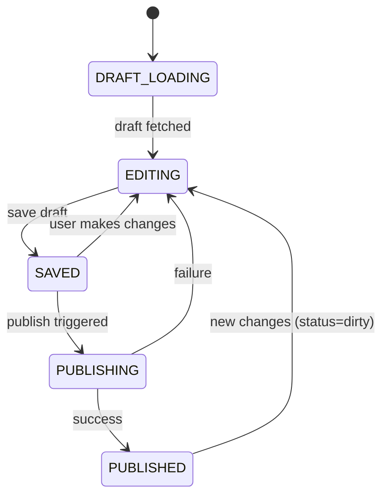
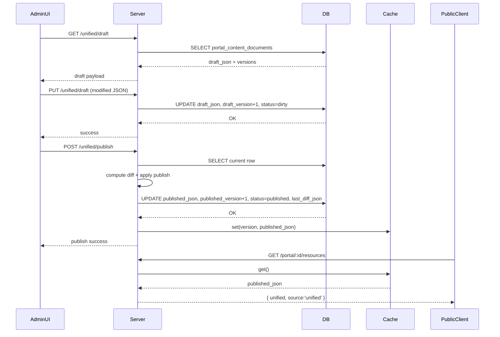

# معماری محتوای یکپارچه پرتال

این سند چرخه کامل مدیریت و انتشار محتوای یکپارچه پرتال (Unified Portal Content) را توضیح می‌دهد.

## خلاصه مسئله قبلی
پیش از این محتوای ناحیه پایینی پرتال از چند منبع جداگانه (بلوک‌های متنی، اعلانات، دانلودها) تأمین می‌شد و منشأ چندگانگی و drift بین خروجی عمومی و UI ادمین بود. همچنین مسیر انتشار واحد و diff قابل اتکا وجود نداشت.

## هدف معماری جدید
- تجمیع همه محتوای قابل ویرایش (sections, announcements, downloads) در یک سند JSON نسخه‌دار
- پشتیبانی draft/published + ثبت diff آخرین انتشار
- مسیر fallback به legacy فقط در نبود نسخه منتشر شده (برای گذار امن)
- امکان کش درون‌حافظه‌ای نسخه منتشر شده برای کاهش بار DB

## مدل داده
```mermaid
erDiagram
  portal_content_documents ||--o{ versions : track
  portal_content_documents {
    int id PK
    text doc_key
    jsonb draft_json
    jsonb published_json
    int draft_version
    int published_version
    text status // draft | dirty | published
    jsonb last_diff_json
    timestamptz created_at
    timestamptz updated_at
  }
```

### کلید ثابت
- doc_key = `portal_main` (در حال حاضر یک داکیومنت اصلی؛ در آینده می‌توان چند سند تماتیک داشت.)

### ساختار JSON (مثال)
```json
{
  "displayTitle": "پرتال خدمات نماینده",
  "sections": [ { "id": "id_x1", "title": "راهنما", "body": "...", "order": 10 } ],
  "announcements": [ { "id": "id_a1", "title": "به‌روزرسانی نسخه", "content": "...", "priority": 10, "type": "info", "isActive": true } ],
  "downloads": [ { "id": "id_d1", "title": "اپ تلگرام", "downloadLink": "https://...", "isActive": true, "displayOrder": 0 } ],
  "metadata": { "locale": "fa-IR" }
}
```

## فلو حالت‌ها


## API های ادمین (Unified)
| Endpoint | Method | توضیح |
|----------|--------|-------|
| /api/admin/portal-content/unified/draft | GET | دریافت آخرین پیش‌نویس + نسخه‌ها |
| /api/admin/portal-content/unified/draft | PUT | ذخیره پیش‌نویس (افزایش draft_version + status=dirty) |
| /api/admin/portal-content/unified/publish | POST | انتشار: محاسبه diff، کپی draft->published، افزایش published_version |
| /api/admin/portal-content/unified/status | GET | وضعیت/نسخه فعلی |
| /api/admin/portal-content/unified/diff | GET | آخرین diff انتشار |

## Diff Logic
- مقایسه کلید به کلید بین draft قبلی منتشر شده و draft فعلی
- ذخیره after/before برای بخش‌هایی که تغییر کرده‌اند (مقادیری بزرگ truncate نمی‌شوند فعلاً)

## Endpoint عمومی
`GET /api/portal/:publicId/resources`
1. تلاش برای لوک آپ کش in-memory (نسخه منتشر شده unified)
2. اگر نبود، DB select سند `portal_main`
3. اگر published_json موجود بود: خروجی `{ unified, source:'unified' }`
4. در غیر اینصورت fallback: جداول legacy (announcements + app_downloads) → `{ appDownloads, announcements, source:'legacy' }`

## کش درون حافظه
```ts
interface UnifiedPublishedCache {
  version: number;
  doc: any; // published json
  cachedAt: number;
}
```
- invalidate در زمان publish
- مزیت: حذف چندین query تکراری برای ترافیک بالای public portal

## Frontend Admin
- فایل: `client/src/pages/admin/PortalContentManager.tsx`
- تب‌ها: ساختار، اعلانات، دانلودها، diff، پیش‌نمایش
- ویرایش روی کپی محلی (localDraft) + مقایسه JSON برای dirty state
- Ctrl+S → ذخیره پیش‌نویس
- انتشار → invalidation + refetch diff/status

## Frontend Public
- فایل: `client/src/components/PortalResources.tsx`
- اگر `source==='unified'`: رندر سه ناحیه (announcements، downloads، sections)
- اگر legacy: همان منطق قبلی (تغییر نکرده برای بخش مالی بالا)
- عدم لمس بخش مالی صفحه `portal.tsx`

## خط سیر انتشار امن (Safe Migration)
1. اضافه شدن جدول و migration
2. افزودن API های موازی با legacy
3. استفاده Admin فقط از unified
4. Endpoint عمومی: اولویت unified ولی fallback امن
5. پس از اطمینان، حذف مسیر legacy (فاز بعدی)

## معیارهای پذیرش (Acceptance Criteria)
- انتشار موفق: افزایش published_version و invalidation کش
- diff غیر خالی پس از تغییر واقعی
- عدم شکست endpoint عمومی در صورت نبود published_json
- UI عمومی بدون تغییر در بخش مالی
- ذخیره پیش‌نویس بدون تداخل با انتشار همزمان (بعداً می‌توان optimistic locking افزود)

## بهبودهای پیشنهادی آینده
- Optimistic Concurrency بر پایه draft_version در PUT
- ثبت تاریخچه کامل انتشارات در جدول history جداگانه
- ایندکس jsonb مسیرهای پر استفاده (در صورت نیاز به فیلتر سروری)
- Internationalization چند زبانه (en-US)
- Validation schema (zod) برای سند قبل از ذخیره

## دیاگرام Sequence انتشار


## تست‌های پیشنهادی (چک لیست)
- [ ] GET draft بدون published اولیه → status=draft
- [ ] PUT draft تغییر ساختار → status=dirty
- [ ] Publish → status=published + diff ذخیره شود
- [ ] GET public پس از publish → source=unified
- [ ] حذف موقت published_json (شبیه‌سازی) → fallback legacy
- [ ] بارگذاری مجدد Admin پس از انتشار → isDirty=false

---
آخرین به‌روزرسانی: 2025-10-05
