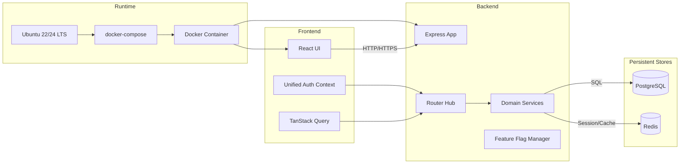
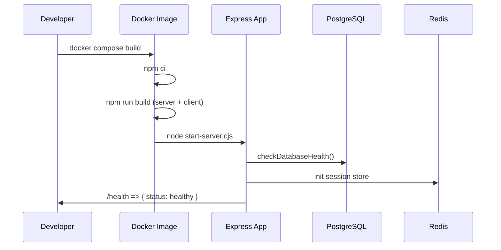

# نقشه مهندسی MarFaNet – اسکن سه‌بعدی کامل

> این سند حافظه مهندسی و مرجع جامع برای تحلیل، دیباگ و استقرار MarFaNet روی سرور Ubuntu 22.x است. تمام لایه‌ها (Frontend، Backend، زیرساخت، و بستر اجرایی) در این نقشه پوشش داده شده‌اند.

---

## 1. نمای کلی سیستم
- **Frontend**: React 18 + Vite با روتینگ Wouter، مدیریت حالت TanStack Query، کانتکست احراز هویت یکپارچه، تم تیره/روشن، و مجموعه کامپوننت‌های اختصاصی داشبورد.
- **Backend**: Express 4 با ساختار ماژولار، ۲۵+ ماژول مسیر (Routes)، میان‌افزارهای ثبت لاگ، کشف سلامت، و سرویس‌های پس‌زمینه (Outbox, Drift Jobs).
- **Shared Layer**: اسکیماهای Drizzle ORM، تایپ‌های مشترک، و کتابخانه‌های کاربردی مشترک بین سرور و کلاینت.
- **Database**: PostgreSQL 14 با لایهٔ دسترسی Drizzle و سیستم مانیتورینگ سلامت.
- **Cache & Session**: Redis برای ذخیره نشست و کش.
- **Deployment**: Docker (multi-stage)، docker-compose (app + db + redis) و اسکریپت‌های استقرار تک‌فرمانی.



---

## 2. نقشه دایرکتوری و اجزای کلیدی
| مسیر | نقش | نکات کلیدی |
|------|-----|-------------|
| `client/src/pages` | صفحات داشبورد، پرتال، مدیریت محتوا، KPI و ... | Lazy loading، تم تاریک، UX سازگار با موبایل |
| `client/src/components` | لایه ارائه، فرم‌ها، Gridها، مانیتور زنده، آپلود | شامل Progress، مانیتور Real-Time، و ماژول‌های Modular UI |
| `client/src/contexts` | `UnifiedAuthProvider`, `SidebarProvider` | هماهنگی بین احراز هویت و ناوبری |
| `client/src/services` | ارتباط با API، مدیریت درخواست‌ها | استفاده از TanStack Query و fetch با session cookies |
| `server/index.ts` | ورودی اصلی؛ پیکربندی Express، سشن، استاتیک، health، workers | پذیرش تنظیمات تولید/توسعه و مدیریت Outbox/Drift |
| `server/routes.ts` | رجیستر مرکزی ۲۵+ ماژول مسیر | این فایل ستون فقرات سوییچ روتینگ است |
| `server/routes/*.ts` | ماژول‌های API: فاکتورها، KPI، پرتال محتوا، فایل، SLA، ... | اکثراً با میدل‌ور احراز هویت و ثبت لاگ |
| `server/services` | سرویس‌های دامنه (Feature Flags, Outbox, Drift, Ledger ...) | تعامل با DB و سیستم‌های خارجی |
| `server/middleware` | Performance monitor، Unified Auth | کنترل سربار، لاگ و امنیت |
| `shared/schema` | تعریف جداول PostgreSQL/Drizzle | مرجع واحد برای migrations و ORM |
| `scripts/*.ts` | اسکریپت‌های عملیاتی (seed, drift, backfill, regression) | برای مراقبت و پایش سیستمی |
| `Dockerfile` | Multi-stage (builder + production) | بیلد یکپارچه سرور + کلاینت |
| `docker-compose.yml` | استقرار سه سرویس app/db/redis | استفاده از healthcheck و volume برای لاگ/دیتا |
| `logs/*.log` | خروجی رانتایم برای مانیتورینگ | شامل health، shadow logs، drift و ... |

---

## 3. چرخه اجرای نرم‌افزار
### 3.1 حالت توسعه
1. اجرای `npm run dev` ⇒ استفاده از `tsx` برای سرور + Vite dev server.
2. سشن‌ها در PostgreSQL ذخیره می‌شوند؛ Redis محلی اختیاری است.
3. Hot reload از طریق `setupVite` فعال است.

### 3.2 حالت تولید / Docker
1. `npm ci` در مرحلهٔ Builder اجرا شده و `npm run build` سرور و کلاینت را خروجی می‌دهد:
   - خروجی سرور: `dist/server`, `dist/shared`, `dist/client`.
   - خروجی کلاینت: `dist/public` (از طریق `vite.config.ts`).
2. مرحله Production فقط `node_modules`, `dist`, `start-server.cjs` را نگه می‌دارد.
3. `start-server.cjs` ⇒ اجرای `server/index.ts` بیلد شده.
4. ارائه فایل‌های استاتیک توسط `serveStatic` از `dist/public` انجام می‌شود.



---

## 4. لایهٔ Backend و مسیرهای حیاتی
**هستهٔ رجیستریشن**: `registerRoutes(app)` در `server/routes.ts` با منطق زیر:
- middleware‌های سراسری: 
  - `performanceMonitoringMiddleware`
  - ثبت لاگ ساختاری برای `/api/*`
  - مدیریت سشن برای `/api/admin/*` و کنارگذاشتن روی مسیرهای عمومی `/api/portal`
- Feature Flagها: `featureFlagManager`, shadow/switch برای پورتال محتوا، Outbox، Reconciliation.
- سرویس‌ها: `OutboxService`, `DriftJobService`, `OutboxMonitor`.
- مسیرهای اصلی (نمونه):
  - مالی: `/api/unified-financial`, `/api/debt-verification`, `/api/allocations/*`
  - مدیریت محتوا: `/api/admin/portal-content-blocks`, `/api/admin/app-downloads`
  - مانیتورینگ: `/api/dashboard`, `/api/dashboard/revenue-trend`, `/api/sla/*`
  - عملیات فایل: `/api/admin/upload-json`, `/api/admin/active-actions`
  - ابزار: `/api/feature-flags`, `/api/database-optimization`

**پایپ‌لاین پاسخ**:
1. درخواست وارد Express می‌شود.
2. میدل‌ورهای امنیتی + ثبت لاگ + توکن سشن اجرا می‌گردند.
3. روت مناسب اجرا شده و از سرویس مرتبط استفاده می‌کند.
4. سرویس‌ها از طریق `db`, `pool`, و `shared/schema` به PostgreSQL متصل می‌شوند.
5. پاسخ JSON یا فایل به کلاینت بازگردانده می‌شود.

---

## 5. لایهٔ Frontend و UX
- **Routing**: Wouter با الگوی `/portal/:publicId`, `/admin/*`, `/dashboard` و ...
- **Layouts**: `Sidebar`, `Header`, `AdminLayout` با پشتیبانی موبایل و تم تاریک.
- **State**: TanStack Query برای داده‌های server-side، Context API برای احراز هویت، سایدبار، و تنظیمات.
- **ویژگی‌های کلیدی**:
  - Upload JSON با مانیتور Real-Time (`LiveProcessingMonitor`, `ProcessingProgressBar`).
  - مدیریت پورتال محتوا با تب‌های Blocks/Announcements/Downloads/Preview.
  - داشبورد KPI و آمار لحظه‌ای.
  - صفحات عمومی نمایندگان با URL اختصاصی (`/portal/:publicId`).

---

## 6. سرویس‌های پس‌زمینه و Flagها
| سرویس | توضیح | وابستگی |
|--------|--------|----------|
| `OutboxWorker` | با تریگر Feature Flag `outbox_enabled` فعال می‌شود؛ مسئول صف پیام‌ها | PostgreSQL (جدول outbox) |
| `OutboxMonitor` | مانیتورینگ health برای Outbox | Feature Flag `guard_metrics_alerts` |
| `DriftJobService` | تطبیق بدهی‌ها (shadow/ enforce) | Flag `active_reconciliation` |
| `FeatureFlagManager` | حالت‌های multi-stage (`off`, `shadow`, `full`, ...) | در سطح سرور ذخیره می‌شود |

---

## 7. خط لولهٔ استقرار Ubuntu 22 (هدف اصلی)
1. **پیش‌نیازها**: Docker Engine + Compose plugin، Node.js 20 (برای اجرای اسکریپت‌ها خارج از Docker در صورت نیاز).
2. **متغیرهای محیطی ضروری**: `DATABASE_URL`, `SESSION_SECRET`, `PORT`, `REDIS_URL`, مسیر `LOG_DIRECTORY`.
3. **دستور استاندارد**:
   ```bash
   docker compose build --no-cache app
   docker compose up -d
   docker compose logs -f app
   ```
4. **پوشه‌های Volume**:
   - `./logs` ⇐ `/app/logs`
   - `postgres-data` ⇐ `/var/lib/postgresql/data`
   - `redis-data` ⇐ `/data`
5. **نقاط شکست شناسایی شده**:
   - نبود خروجی `dist/public` ⇒ خطای `Could not find the build directory: /app/dist/public`.
   - تلاش برای کپی `client/dist` ⇒ شکست مرحلهٔ build.
   - عدم تنظیم `REDIS_URL` ⇒ خطای health check Redis.
   - اجرای موازی خارج از Docker (مثلاً `npm run dev`) ⇒ لاگ‌های متناقض و توهم «سازوکار دوگانه».

---

## 8. تشخیص سازوکار دوگانه و راهکار انسجام
- **نشانه‌ها**: در لاگ‌ها پیام‌های dev (`tsx server/index.ts`) همزمان با خطای داکر مشاهده شده است.
- **ریشه**: اجرای فرآیند توسعه (با tsx) در محیط میزبان در کنار کانتینر داکر ⇒ هر دو به یک پورت و دیتاست دسترسی دارند.
- **راهکار یکپارچه**:
  1. محدودسازی اجرا به داخل Docker در محیط Production.
  2. اطمینان از تولید `dist/public` در مرحلهٔ build.
  3. تصحیح Dockerfile برای عدم استفاده از مسیرهای اشتباه.
  4. جلوگیری از اجرای `npm run dev` پس از استقرار (بستن سرویس‌ها یا غیر فعال کردن systemd های قدیمی).

```mermaid
graph LR
  HostProcess[اجرای محلی dev (tsx)] -->|پورت 3000| Network
  DockerProcess[کانتینر app] -->|پورت 3000| Network
  Network --> Conflict{تداخل پورت / سرویس}
  Conflict -->|لاگ‌های متناقض| Observability
  Conflict -->|سشن‌های مخدوش| Redis
```

---

## 9. چک‌لیست دیباگ و پایش
- بررسی سلامت PostgreSQL: `docker compose exec db pg_isready -U postgres`
- بررسی REDIS: `docker compose exec redis redis-cli ping`
- تست API: `curl http://localhost:3000/health`
- مانیتور لاگ: `tail -f logs/server.log`
- اعتبارسنجی Build: 
  ```bash
  npm run build:server
  npm run build:client
  test -d dist/public && test -f dist/server/index.js
  ```

---

## 10. گام‌های بعدی پیشنهادی
1. **تکمیل مستندسازی DB**: ترسیم ERD با توجه به `shared/schema` و migrations برای درک وابستگی‌های دیتاست (پیشنهاد).
2. **افزودن تست‌های E2E**: برای مسیرهای کلیدی `/api/admin/portal-content-blocks`, `/api/dashboard`.
3. **اتومات کردن smoke test**: اسکریپت جداگانه‌ای برای `docker compose up` + `curl` جهت CI.
4. **بررسی امنیت هدرها**: جداسازی تنظیمات Portal و Admin بر مبنای `helmet` برای اطمینان از تطبیق استاندارد OWASP.

---

> این سند باید همراه شما باشد تا هر تغییری در استقرار یا دیباگ، با تصویر کامل سیستم انجام شود. هر بروزرسانی جدی در معماری، باید در این نقشه منعکس گردد.
